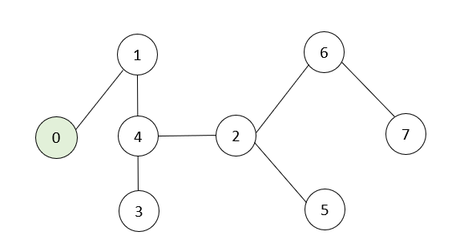

# Example Graph Traversal

# Death First Search

*Depth-first search (DFS) is an algorithm for traversing or searching tree or graph data structures. The algorithm starts at the root node (selecting some arbitrary node as the root node in the case of a graph) and explores as far as possible along each branch before backtracking.

1st iterate:
When starting node push to the stack (0), 0 had stored in variable call current, and it remove from the stack.
If 0 haven't been visited before, mark it as visited, and print it. 
The loop for (int neighbor : graph[current]) iterates over each element (neighbor) in the adjacency list of the current vertex. 
0 had linked to the 1 only, so if 1 haven't been visited before, push it to the stack

2nd iterate:
When the stack (1), 1 had stored in 'current', and it remove from the stack.
If 1 haven been visited before, mark it as visited and print it.
1 had linked to 4 only, so if 4 haven't been visited before, push it to the stack

3rd iterate:
When the stack (4), 4 had stored in 'current', and it remove from the stack.
If 4 haven been visited before, mark it as visited and print it.
4 had linked to the 3 and 2, so 3 and 2 will be push to the stack as they both haven't been visited

4th iterate:
Now stack have (3,2), go through the 3 first, 3 store in 'current' and remove from the stack. * So now stack have (2) only
3 mark as visited and print it. 
As 3 don't linked with any others vertex, so it push nothing to stack

5th iterate:
Now stack is (2), 2 store in 'current' and it remove from the stack. * So now stack had nothing ()
2 haven't been visited so it mark as visited, and print it
As 2 linked with 5 and 6, so both push to stack

6th iterate:
Now stack is (5,6), let say go through 5 first, 5 stored in 'current' and been removed from the stack * So now stack is (6)
5 been mark as visited and print it
5 hadn't link with anyone else, so it push nothing to stack

7th iterate:
Now stack is (6), 6 store in 'current' and remove from the stack
6 been mark as visited and print it
6 had linked to 7, so push 7 to the stack

8th iterate:
Now stack is (7), 7 store in 'current' and remove from the stack * So now the stack had nothing ()
7 been mark as visited and print it
7 don't linked anyone, so it pass nothing

# Breathed First Search

*Breadth First Search (BFS) is a graph traversal algorithm that explores all the vertices in a graph at the current depth before moving on to the vertices at the next depth level. It starts at a specified vertex and visits all its neighbors before moving on to the next level of neighbors. BFS is commonly used in algorithms for pathfinding, connected components, and shortest path problems in graphs.

The starting node (0) is marked as visited (visited[0] = true), and it is enqueued into the queue (queue.push(0)). The queue now contains (0).

The while loop begins, and the front node (0) is dequeued from the queue (current = 0). The node 0 is then processed (printed to the console: cout << 0 << " ";).

The loop for (int neighbor : graph[current]) iterates over the neighbors of the current node (0), which is 1. Since 1 has not been visited before (!visited[1]), it is marked as visited (visited[1] = true), and it is enqueued into the queue (queue.push(1)). The queue now contains (1).

The loop continues, and the front node (1) is dequeued from the queue (current = 1). The node 1 is then processed (printed to the console: cout << 1 << " ";).

The loop for (int neighbor : graph[current]) iterates over the neighbor of the current node (1), which is 4. Since 4 has not been visited before (!visited[4]), it is marked as visited (visited[4] = true), and it is enqueued into the queue (queue.push(4)). The queue now contains (4).

The loop continues, and the front node (4) is dequeued from the queue (current = 4). The node 4 is then processed (printed to the console: cout << 4 << " ";).

The loop for (int neighbor : graph[current]) iterates over the neighbors of the current node (4), which are 1, 2, and 3. Since 1 has already been visited, it is skipped. However, 2 and 3 have not been visited before, so they are both marked as visited (visited[2] = true, visited[3] = true), and they are enqueued into the queue (queue.push(2), queue.push(3)). The queue now contains (2, 3).

The process continues, with the front node being dequeued, processed, and its unvisited neighbors being enqueued into the queue.

